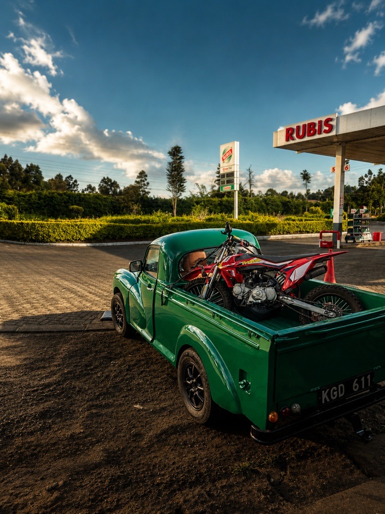
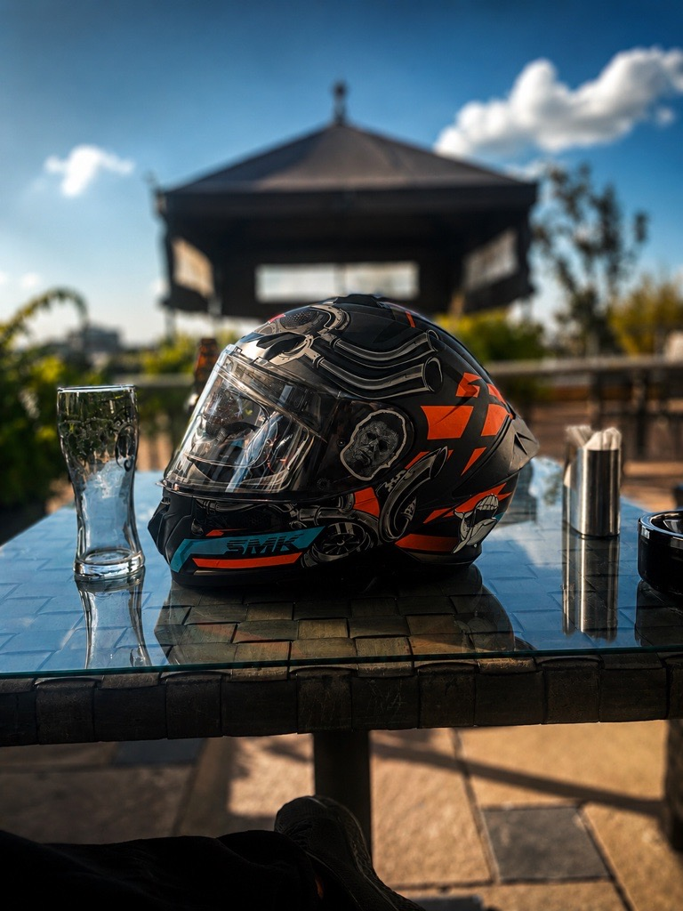

*For riders — and for anyone who's ever felt the road call their name.*

---

There's a moment every rider knows. You twist the throttle, the engine responds, and the world narrows to a ribbon of tarmac ahead of you. No cage around you. No filter between you and the wind. Just speed, lean angle, and something that feels dangerously close to freedom.

To me, that moment is why the motorcycle is without question the greatest vehicle humanity has ever created. Well, I recon pilots might argue otherwise but I know what I'm talking about here...

---

## More Than a Machine

Cars are appliances, trucks are tools and planes are miracles of engineering that keep you sealed away from the sky you're flying through, ships are just boring... all very nice things.

But a motorcycle? A motorcycle is a relationship.

You don't just drive one, you *wear* and become one with it. You lean with it through corners, feel the road texture through the handlebars, sense the weather on your skin in real time and battle crosswinds, for fun! The machine communicates, and you respond. An endless cybernetic loop between man and machine that demands your full presence — not half your attention while you scroll a playlist — every single second. That's not a burden, it's the gift.

No other vehicle in existence makes you feel so *alive* by reminding you gently of your mortality.

## The Physics Are Simply Unfair

Let's talk numbers for a moment. A mid-range sport bike — say, a Kawasaki Ninja 650 or a Yamaha MT-07 — weighs around 190 kilograms and makes 73 horsepower. A mid-size sedan weighs 1,500 kilograms and needs 150 horsepower to feel "sporty."

The motorcycle does more with less, always. It is the most power-efficient, space-efficient, fuel-efficient personal vehicle on the road. In Nairobi traffic — where a 10-kilometre journey can eat an hour of your life — a motorcycle splits lanes, finds gaps, and arrives on time while four-wheelers bake in gridlock. 

>Disclaimer: Travel time estimates do not include the rider's ability to identify roads, shoulders, footpaths, drainage reserves, and occasionally pure optimism as valid traffic infrastructure. 

A motorcycle doesn't just win on the open road. It wins in the city,the dirt track and even when parked in a space where four cars couldn't fit one.

## The Tribe You Didn't Know You Needed

Ride long enough and you'll notice something strange(rightfully so...), strangers nod at you. Just a low, two-fingered acknowledgement, handlebar-height, as you pass each other going opposite directions on a highway.

The Rider's Nod.

It crosses borders, languages, and income brackets. A boda boda rider in Westlands and a tourer on a BMW GS give each other the same nod...well, hiyo ni jaba but don't leave me. A teenager on a 125cc Honda Ace and a retired police officer on a Classic Harley share the same wordless greeting.

No other vehicle creates community like this. Car drivers don't wave at each other. Maybe Mazda CX-5 guys and the Audis always driving on hazard lights without the front plates.  But riders? Riders recognize riders.

## It Teaches You Discipline

Nobody respects the motorcycle who isn't willing to learn from it. Drop your guard, rush a corner, brake too hard in a bend — and the road gives you an instant honest critique. Motorcycles do not flatter incompetence. They reward attention, smoothness, and humility with the most exhilarating ride of your life. They punish ego quickly and without apology.

In that way, riding is one of the best teachers most of us will ever have. It insists you stay present because it makes you read the road, anticipate hazards, plan three seconds ahead at all times. Most importantly, it rewards patience.

Riders tend to become better drivers, better decision-makers under pressure, and more present in their daily lives. When you've spent hours focused on nothing but the road ahead, the noise of everything else starts to matter a little less.  
  
In short, riding teaches one to become more aware of the difference between confidence and recklessness.

## The Spectrum Is Infinite

The greatest trick the motorcycle ever pulled was convincing the world it was one thing.

It is a thousand things. It is the Ducati Panigale V4 screaming down a race circuit at speeds most people will never experience. It is the humble Honda CG125 and Boxer 150s that have carried workers, farmers, schoolchildren, sacks of maize, crates of soda, gas cylinders, and occasionally cargo that appears to defy both physics and common sense across every corner of Kenya.

It is the boda boda rider weaving through Nairobi traffic while everyone else watches the clock. It is the motorcycle climbing the steep, muddy roads of Murang'a after a night of rain. It is the machine linking remote villages in Turkana, Samburu, and Marsabit to the rest of the country when no other vehicle can pass.

It also is the adventure bike crossing the Chalbi Desert. A trail bike carving through the forests of Aberdare, the tourer eating up kilometres between Nairobi, Nakuru, Eldoret, and Mombasa while the rider watches the country unfold one horizon at a time.

It is the dirt bike jumping a ravine. The enduro crossing a river. The commuter carrying a family's livelihood. The superbike chasing perfection through a corner.

*Whatever you need a vehicle to be, there is a motorcycle that is exactly that.*

## A Word to the Non-Riders

You'll say it's dangerous. And you're right — it demands respect.

But consider what we trade away in safety when we seal ourselves inside cars: the landscape becomes a screensaver. Weather becomes an inconvenience to observe. The journey becomes dead time between two places.

*The motorcycle says the journey *is* the destination. And it means it.*

---

## Ride More!

The best vehicle ever made isn't defined by horsepower or price tag or brand legacy. It's defined by what it does to the person riding it — how it sharpens them, frees them, and connects them to the road, the wind, and a global brotherhood and sisterhood of people who chose two wheels over four.

Gear up. Check your mirrors. Twist the throttle.

The road is waiting.

---

*Stay rubber-side down, and ride safe out there. ✌️*
