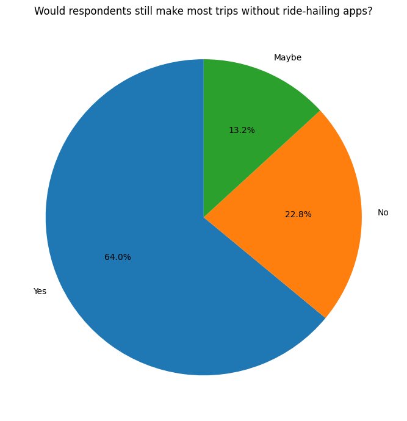
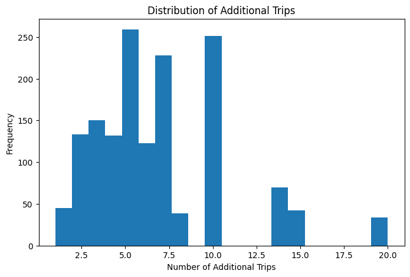
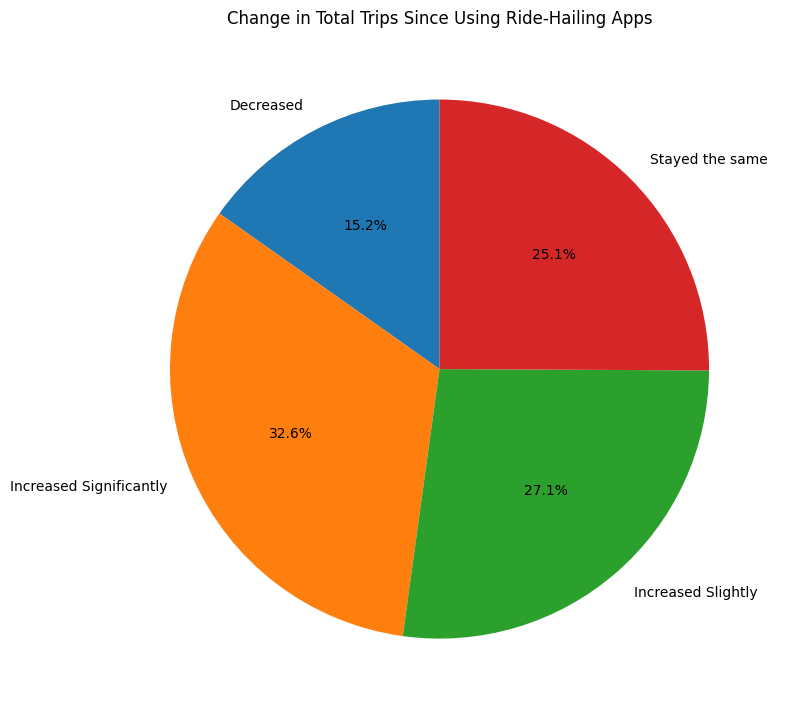
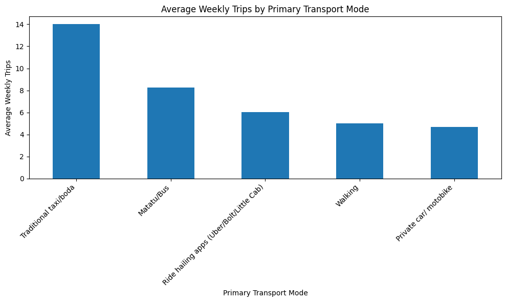
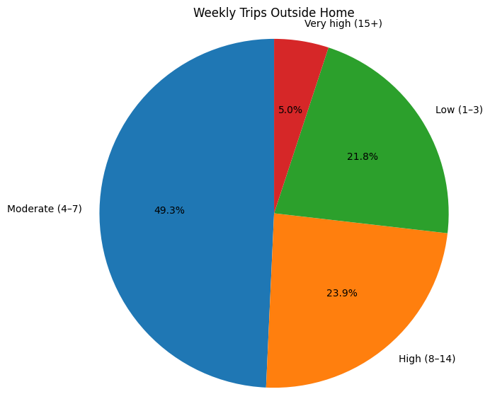
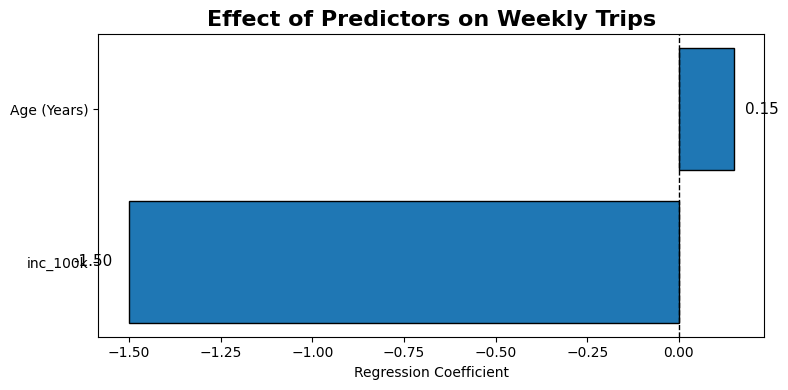
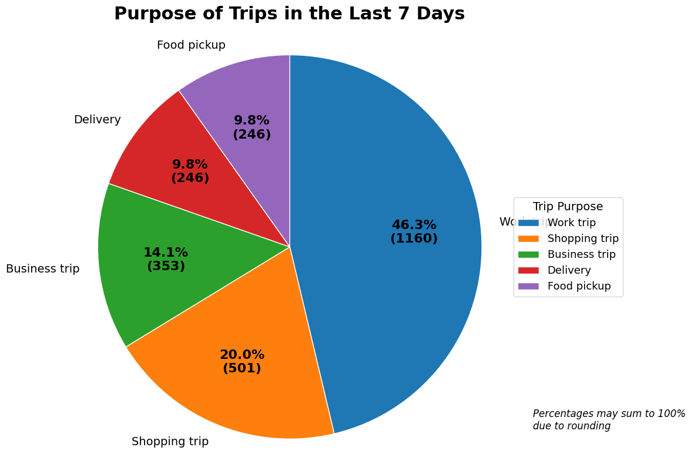
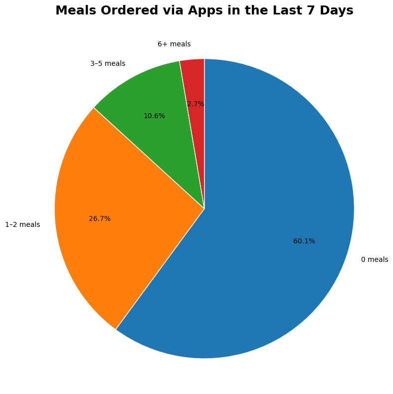
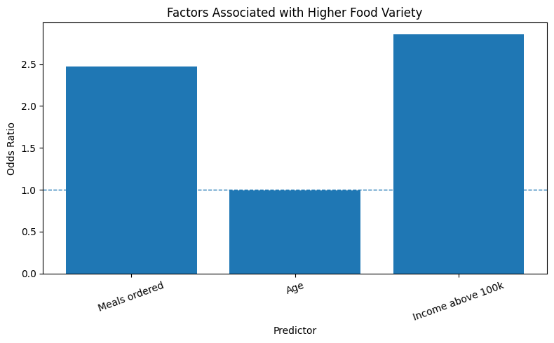

# The Ride-Hailing Paradox: More Trips, Same Spending, Barely Any Food Delivery
---
## Background
---
Digital transportation platforms such as Uber, Bolt, LittleCab, and Uber Eats have transformed the way people travel, access goods, and purchase services. By providing convenient, affordable, and on-demand transport, these platforms have reduced the barriers to mobility and expanded access to economic opportunities for both consumers and service providers.

Improved mobility has the potential to influence several aspects of daily life. Individuals may travel more frequently for work, shopping, business, and leisure, while businesses may benefit from increased customer access and more efficient delivery services. In addition, the integration of food delivery services into ride-hailing platforms has introduced new ways of purchasing meals, which may influence food ordering habits and dietary variety.

That said everyone assumes ride-hailing apps are quietly rewiring how Nairobians move, spend, and eat. Uber and Bolt feel popular enough that the story writes itself, that is, matatus lose riders, wallets open wider (people spend more on transport), food delivery apps fill the gap left by less walking and more convenience.

However the data tells a messier, more interesting story. In a survey of Nairobi commuters 64% said they'd have made their trip anyway, with or without a ride-hailing app. Transport spending barely moved among the respondents, And only 4 in 10 respondents had ever ordered food through an app at all.

Ride-hailing in Nairobi isn't replacing anything. It's layering on top of a transport system that was already working. Here's what the numbers actually show.


---


### 1. Mobility 

The common assumption is that ride-hailing apps have pulled riders away from other transport modes. We tested this directly by asking one simple question: would you have made this trip anyway, without the app? 

The answer determines whether we're looking at genuine reliance on ride-hailing or just a convenient add-on to travel that would have happened regardless.




64% of the respondents indicated that they would make the trips anyway without the platforms being present. This shows that for a majority the digital platforms have come in to compliment the other means of transport already existing like Matatus.

---

For respondents who said their trip frequency increased after adopting ride-hailing apps, how many additional trips are we actually talking about? The chart below breaks this down.

The distribution isn't smooth, it clusters heavily around 5 and 10 additional trips per week, with smaller spikes at 14-15 and 20. That clustering at round numbers is common in self-reported survey data: respondents estimating "about how many more trips" tend to round to 5s and 10s rather than reporting exact counts. It's worth keeping in mind when interpreting the precision of any model built on this variable — the underlying behavior is probably smoother than the reported numbers suggest.




---

#### So how has ride-hailing actually changed how often people travel? 



Nearly 60% of respondents report their total trips have increased since adopting these apps, split fairly evenly between "significantly" (32.6%) and "slightly" (27.1%). A quarter say their travel volume hasn't changed at all, and only 15.2% report making fewer trips.

This sits in tension with the earlier finding that 64% would have made their trip anyway. Both things can be true at once: ride-hailing may not be the *reason* most individual trips happen, while still nudging people toward traveling more often overally because of easier availability lowering the threshold for taking a trip in the first place, even if any single trip wasn't strictly dependent on the app.

---
We also looked at the popular primary means of transport among the respondents. This was supposed to show whether Ride hailing apps is now more popular or rather regularly used among respondents.





The figure above shows that despite the increase in the usage of ride hailing apps, the traditional modes of transport and public transport still tops the list. Therefore, the ride hailing apps can be seen as a substitute for the traditional means of transport as opposed to the notion that its the main means of transport in this day and age. 

---
Additionally, we look at how many trips the respondent made in the last seven days of the survey being conducted. It is important to not that of these trips, ride hailing is not in isolation. It is a culmination of all the modes of transport. 




Nearly half of respondents (49.3%) made 4–7 trips outside their home in the past week, making this the most common travel pattern. Around one in four respondents (23.9%) made 8–14 trips, while 21.8% made 1–3 trips. Only 5.0% made 15 or more trips. Overall, the findings suggest that most people make a moderate number of weekly trips, with relatively few travelling very frequently.

---
### Regression Analysis: Factors Associated with Weekly Trips

#### To examine whether age and income are associated with the number of weekly trips made outside the home.
```
                            OLS Regression Results                            
==============================================================================
Dep. Variable:           weekly_trips   R-squared:                       0.110
Model:                            OLS   Adj. R-squared:                  0.108
Method:                 Least Squares   F-statistic:                     71.67
Date:                Mon, 29 Jun 2026   Prob (F-statistic):           4.46e-30
Time:                        08:40:10   Log-Likelihood:                -3122.3
No. Observations:                1165   AIC:                             6251.
Df Residuals:                    1162   BIC:                             6266.
Df Model:                           2                                         
Covariance Type:            nonrobust                                         
===============================================================================
                  coef    std err          t      P>|t|      [0.025      0.975]
-------------------------------------------------------------------------------
const           3.9637      0.549      7.223      0.000       2.887       5.040
Age (Years)     0.1501      0.020      7.488      0.000       0.111       0.189
inc_100k       -1.5010      0.127    -11.844      0.000      -1.750      -1.252
==============================================================================
Omnibus:                      259.027   Durbin-Watson:                   2.111
Prob(Omnibus):                  0.000   Jarque-Bera (JB):              690.833
Skew:                           1.149   Prob(JB):                    9.72e-151
Kurtosis:                       5.991   Cond. No.                         162.
==============================================================================

Notes:
[1] Standard Errors assume that the covariance matrix of the errors is correctly specified.

```



**What drives how often people travel?**

Running weekly trip frequency against age and income tells a clear, if modest, story. Both variables are statistically significant (p < 0.001), but they point in different directions:

- **Age has a positive effect**: each additional year of age is associated with roughly 0.15 more trips per week. Older respondents, on average, travel somewhat more frequently — possibly reflecting more established routines, family obligations, or work travel.
- **Income has a much larger, negative effect**: respondents earning above KSh 100,000/month make about 1.5 *fewer* weekly trips than those below that threshold. This is the more striking result because higher earners aren't traveling more despite likely having greater means to do so. It may reflect remote or flexible work arrangements, fewer errands requiring travel, or simply less reliance on frequent short trips typical of lower-income commuting patterns.

**A caveat worth stating plainly:** the model explains only about 11% of the variation in weekly trips (R² = 0.110). Age and income matter, and matter reliably, but they're far from the whole picture since factors like occupation, household structure, or location within Nairobi likely carry more weight than this model captures.

The residuals also aren't well-behaved: the distribution is right-skewed (skew = 1.15) with fatter tails than a normal distribution (kurtosis = 5.99), and the Jarque-Bera test strongly rejects normality (p < 0.001). This isn't surprising since weekly trip counts are count data with a natural floor at zero, which OLS isn't built to handle well. 

---

**What predicts whether someone's trips increased after adopting ride-hailing apps?**

```


Optimization terminated successfully.
         Current function value: 1.117202
         Iterations: 63
         Function evaluations: 67
         Gradient evaluations: 67
                             OrderedModel Results                             
==============================================================================
Dep. Variable:        trip_change_ord   Log-Likelihood:                -1338.4
Model:                   OrderedModel   AIC:                             2697.
Method:            Maximum Likelihood   BIC:                             2748.
Date:                Mon, 29 Jun 2026                                         
Time:                        06:25:49                                         
No. Observations:                1198                                         
Df Residuals:                    1188                                         
Df Model:                           7                                         
==========================================================================================
                             coef    std err          z      P>|z|      [0.025      0.975]
------------------------------------------------------------------------------------------
Age (Years)               -0.1002      0.013     -7.910      0.000      -0.125      -0.075
inc_100k                  -0.2083      0.081     -2.563      0.010      -0.368      -0.049
emp_Employed(Informal)    16.6066    608.882      0.027      0.978   -1176.780    1209.993
emp_Self employed          2.3632      0.250      9.470      0.000       1.874       2.852
emp_Student              -29.5100   1.51e+04     -0.002      0.998   -2.97e+04    2.97e+04
emp_Unemployed            -2.2124      0.276     -8.018      0.000      -2.753      -1.672
gender_Male               -0.0103      0.117     -0.088      0.930      -0.239       0.219
-1/0                      -5.4997      0.362    -15.202      0.000      -6.209      -4.791
0/1                        0.5028      0.058      8.709      0.000       0.390       0.616
1/2                        0.3023      0.053      5.705      0.000       0.198       0.406
==========================================================================================

```

This ordered logit model looks at the same "change in trips" categories from the pie chart above (decreased, stayed the same, increased slightly, increased significantly) and asks what predicts landing in a higher category. Several predictors come through cleanly:

- **Age has a negative effect** (coef = -0.100, p < 0.001): This means that older respondents are less likely to report increased trip-taking. Combined with the earlier OLS result, this is worth sitting with because older respondents take more trips *in absolute terms*, but ride-hailing specifically hasn't shifted their travel behavior as much as it has for younger respondents.
- **Higher income is associated with a smaller increase** (coef = -0.208, p = 0.010), which is consistent with the earlier finding that higher earners aren't the ones driving up trip frequency.
- **Self-employment stands out as the strongest positive driver** (coef = 2.363, p < 0.001) — self-employed respondents are substantially more likely to report increased trips, plausibly because ride-hailing plugs directly into income-generating movement (client visits, deliveries, multiple work sites) rather than discretionary travel.
- **Unemployment has a strong negative effect** (coef = -2.212, p < 0.001) — unemployed respondents are markedly less likely to report increased trips, which tracks with tighter budget constraints limiting ride-hailing use to necessity trips only.
- **Gender shows no meaningful effect** (p = 0.930), suggesting trip-frequency changes aren't gendered in this sample.

**Note** The coefficients for **Student** (-29.51, SE = 15,100) and **Informal Employment** (16.61, SE = 609) are not usable. The standard errors are enormous relative to the coefficients, and this is a textbook sign of *near-perfect separation* likely because very few students or informally employed respondents fall into certain outcome categories, so the model can't estimate those effects reliably. 

---
### 2. Trade
#### Which reasons constitutes most trips taken by the respondents?
**What are people actually using these apps for?**

If there was any doubt that ride-hailing in Nairobi is fundamentally a *work* tool rather than a lifestyle convenience, this chart settles it. 




Work-related trips accounted for the largest share of travel in the last seven days (46.3%, 1,160 trips), exceeding the combined total of all other trip purposes. Shopping was the second most common reason for travel (20.0%), followed by business trips (14.1%). Delivery (9.6%) and food pickup (9.9%) represented a relatively small share of overall travel.

These findings complement the regression results, which showed that self-employed respondents were more likely to report increased trip frequency. Together, the results suggest that ride-hailing platforms are used predominantly to support work, business, and essential daily activities, rather than food delivery or other convenience-based services. While ride-hailing applications have expanded beyond transportation, the survey indicates that their primary value for respondents lies in improving access to employment, business opportunities, and routine activities. This suggests that, within this sample, digital transportation platforms function more as an enabler of economic participation than as a driver of lifestyle or convenience-oriented consumption.

---

#### Does More Travel Lead to Higher Transport Spending?

```
                             OLS Regression Results                            
===============================================================================
Dep. Variable:     log_transport_spend   R-squared:                       0.024
Model:                             OLS   Adj. R-squared:                  0.022
Method:                  Least Squares   F-statistic:                     9.322
Date:                 Mon, 29 Jun 2026   Prob (F-statistic):           4.33e-06
Time:                         06:25:50   Log-Likelihood:                -2188.4
No. Observations:                 1124   AIC:                             4385.
Df Residuals:                     1120   BIC:                             4405.
Df Model:                            3                                         
Covariance Type:             nonrobust                                         
================================================================================
                   coef    std err          t      P>|t|      [0.025      0.975]
--------------------------------------------------------------------------------
const            6.5377      0.275     23.745      0.000       5.997       7.078
weekly_trips    -0.0239      0.014     -1.652      0.099      -0.052       0.004
inc_100k        -0.2937      0.065     -4.493      0.000      -0.422      -0.165
Age (Years)      0.0466      0.010      4.724      0.000       0.027       0.066
==============================================================================
Omnibus:                      145.509   Durbin-Watson:                   2.014
Prob(Omnibus):                  0.000   Jarque-Bera (JB):             1391.279
Skew:                           0.177   Prob(JB):                    7.72e-303
Kurtosis:                       8.439   Cond. No.                         171.
==============================================================================

Notes:
[1] Standard Errors assume that the covariance matrix of the errors is correctly specified.

```
The analysis found no statistically significant relationship between the number of weekly trips and overall transport expenditure. This suggests that respondents who travel more do not necessarily spend more on transport. Instead, they may be using ride-hailing services as a substitute for other transport options, rather than increasing their overall transport costs.

Income and age were the only significant predictors of transport expenditure. Respondents earning more than KSh 100,000 per month reported lower transport spending than those in the reference income group, while older respondents tended to spend slightly more on transportation.

Although these relationships were statistically significant, the model explained only 2.4% of the variation in transport spending (R² = 0.024). This indicates that most differences in transport expenditure are influenced by factors not captured in this study, such as travel distance, transport mode, vehicle ownership, fuel costs, and commuting patterns.


The findings suggest that ride-hailing platforms are changing how people travel rather than substantially increasing how much they spend on transportation. Users appear to integrate these services into their existing travel patterns rather than using them in ways that significantly increase their overall transport expenditure.

---

### 3. Diet
#### **What predicts how many meals people order via app?**

The analysis examined whether age, income, and delivery app usage influence the number of meals respondents order through mobile applications.

```
                            OLS Regression Results                            
==============================================================================
Dep. Variable:          meals_ordered   R-squared:                       0.190
Model:                            OLS   Adj. R-squared:                  0.188
Method:                 Least Squares   F-statistic:                     88.08
Date:                Mon, 29 Jun 2026   Prob (F-statistic):           3.41e-51
Time:                        06:25:50   Log-Likelihood:                -1765.7
No. Observations:                1128   AIC:                             3539.
Df Residuals:                    1124   BIC:                             3560.
Df Model:                           3                                         
Covariance Type:            nonrobust                                         
=================================================================================
                    coef    std err          t      P>|t|      [0.025      0.975]
---------------------------------------------------------------------------------
const             1.0588      0.212      5.000      0.000       0.643       1.474
delivery_user     1.1586      0.081     14.276      0.000       0.999       1.318
Age (Years)      -0.0343      0.008     -4.549      0.000      -0.049      -0.019
inc_100k         -0.0472      0.052     -0.909      0.363      -0.149       0.055
==============================================================================
Omnibus:                      194.309   Durbin-Watson:                   2.049
Prob(Omnibus):                  0.000   Jarque-Bera (JB):              318.801
Skew:                           1.115   Prob(JB):                     5.93e-70
Kurtosis:                       4.344   Cond. No.                         191.
==============================================================================

Notes:
[1] Standard Errors assume that the covariance matrix of the errors is correctly specified.

```
The strongest predictor was delivery app usage. Respondents who used food delivery services ordered significantly more meals than those who did not, confirming that active users are much more likely to rely on these platforms for meal purchases.

Age also had a significant effect, with younger respondents ordering slightly more meals through mobile apps than older respondents. In contrast, income was not a significant predictor, suggesting that food ordering through apps was not strongly influenced by whether respondents earned above or below KSh 100,000 per month.

The model explained approximately 19% of the variation in the number of meals ordered (R² = 0.190). While this indicates that the selected variables contribute to understanding food-ordering behaviour, other factors—such as convenience, restaurant availability, delivery costs, lifestyle, and personal preferences—are also likely to influence how often people order meals through mobile apps.


---

#### What influences the variety of food choice?
```

The analysis examined whether age, income, and the use of food delivery services are associated with the variety of foods consumed.


                             OrderedModel Results                             
==============================================================================
Dep. Variable:       food_variety_ord   Log-Likelihood:                -460.65
Model:                   OrderedModel   AIC:                             929.3
Method:            Maximum Likelihood   BIC:                             949.2
Date:                Mon, 29 Jun 2026                                         
Time:                        06:25:50                                         
No. Observations:                1075                                         
Df Residuals:                    1071                                         
Df Model:                           3                                         
=================================================================================
                    coef    std err          z      P>|z|      [0.025      0.975]
---------------------------------------------------------------------------------
delivery_user    34.5413   3.04e+04      0.001      0.999   -5.96e+04    5.97e+04
Age (Years)      -0.0189      0.021     -0.900      0.368      -0.060       0.022
inc_100k          0.5889      0.138      4.268      0.000       0.318       0.859
0.0/1.0          34.8295   3.04e+04      0.001      0.999   -5.96e+04    5.97e+04
```

The results indicate that food delivery users generally reported greater food variety than non-users, suggesting that access to delivery platforms may expose consumers to a wider range of meal options. However, the model could not reliably estimate the size of this effect because almost all delivery users reported high levels of food variety. As a result, the relationship should be interpreted qualitatively rather than quantitatively.

Income was also a significant predictor of food variety. Respondents earning more than KSh 100,000 per month were more likely to report consuming a greater variety of foods than those in the reference income group. In contrast, age was not significantly associated with food variety.

---
The big question we ask here is whether ride hailing apps have drawn people away from normal cooking and buying food locally to ordering foods online which brings convenience and saves on time. We therefore assess this by looking at the number of orders one makes in a week. 



Most respondents (60.1%) did not order any meals through mobile apps. About one in four respondents (26.7%) ordered between one and two meals, while only a small proportion ordered meals more frequently (10.6% ordered 3–5 meals and 2.7% ordered six or more). Overall, the findings indicate that food ordering through mobile apps is relatively infrequent among most respondents.
The low uptake of food ordering services may reflect user preferences and local market conditions. Many consumers may prefer preparing meals at home, purchasing food directly from nearby restaurants or vendors, or may not have regular access to restaurants that offer delivery through ride-hailing platforms. In addition, delivery fees, food prices, and limited availability of delivery services in some areas may discourage frequent use.


---

#### What influences ones choices of food ordered between age and income. 
```
Optimization terminated successfully.
         Current function value: 0.452462
         Iterations: 216
         Function evaluations: 378
                             OrderedModel Results                             
==============================================================================
Dep. Variable:       food_variety_ord   Log-Likelihood:                -468.75
Model:                   OrderedModel   AIC:                             945.5
Method:            Maximum Likelihood   BIC:                             965.3
Date:                Mon, 29 Jun 2026                                         
Time:                        06:25:51                                         
No. Observations:                1036                                         
Df Residuals:                    1032                                         
Df Model:                           3                                         
=================================================================================
                    coef    std err          z      P>|z|      [0.025      0.975]
---------------------------------------------------------------------------------
meals_ordered     0.9062      0.069     13.214      0.000       0.772       1.041
Age (Years)      -0.0064      0.018     -0.355      0.723      -0.042       0.029
inc_100k          1.0484      0.119      8.828      0.000       0.816       1.281
0.0/1.0           2.7095      0.488      5.557      0.000       1.754       3.665
=================================================================================
This analysis examined whether the number of meals ordered through mobile apps, age, and income influence the variety of foods consumed.

The results show that the number of meals ordered through mobile apps was the strongest predictor of food variety. Respondents who ordered meals more frequently were significantly more likely to report consuming a wider variety of foods. This suggests that regular use of food delivery services provides greater access to diverse meal options.

Income was also positively associated with food variety. Respondents earning more than KSh 100,000 per month were more likely to report greater dietary diversity, even after accounting for how often they ordered meals. This indicates that higher income may increase access to a broader range of food choices.

In contrast, age was not significantly associated with food variety, suggesting that dietary diversity was influenced more by ordering behaviour and income than by respondents' age.

Key takeaway: The findings suggest that frequent use of food delivery services and higher income are associated with greater food variety. Among the factors examined, the frequency of ordering meals through mobile apps emerged as the strongest predictor of dietary diversity.

```



*Values above 1 indicate a higher likelihood of reporting greater food variety.*

Meals ordered and income appear to increase the likelihood of higher food variety, while age has little effect because it is close to 1.
Respondents who ordered more meals through mobile apps were more likely to report greater food variety. Higher-income respondents also tended to have more diverse food choices. Age had little influence on food variety.

---

### 4. Price Sensitivity (Incase of an increase in price will the respondents stop using the apps)


```
                            OLS Regression Results                            
==============================================================================
Dep. Variable:           weekly_trips   R-squared:                       0.142
Model:                            OLS   Adj. R-squared:                  0.139
Method:                 Least Squares   F-statistic:                     46.47
Date:                Mon, 29 Jun 2026   Prob (F-statistic):           3.68e-36
Time:                        06:25:51   Log-Likelihood:                -2991.4
No. Observations:                1124   AIC:                             5993.
Df Residuals:                    1119   BIC:                             6018.
Df Model:                           4                                         
Covariance Type:            nonrobust                                         
=======================================================================================
                          coef    std err          t      P>|t|      [0.025      0.975]
---------------------------------------------------------------------------------------
const                   4.5903      0.689      6.659      0.000       3.238       5.943
log_transport_spend    -0.0803      0.061     -1.312      0.190      -0.200       0.040
ridehail_user           0.9477      0.209      4.538      0.000       0.538       1.357
Age (Years)             0.1418      0.020      7.111      0.000       0.103       0.181
inc_100k               -1.6283      0.126    -12.921      0.000      -1.876      -1.381
==============================================================================
Omnibus:                      203.508   Durbin-Watson:                   2.121
Prob(Omnibus):                  0.000   Jarque-Bera (JB):              485.770
Skew:                           0.981   Prob(JB):                    3.28e-106
Kurtosis:                       5.553   Cond. No.                         211.
==============================================================================

Notes:
[1] Standard Errors assume that the covariance matrix of the errors is correctly specified.

```

The OLS regression model indicates that age is positively associated with weekly travel frequency, while higher-income respondents report significantly fewer weekly trips. Transport expenditure exhibits a weak negative relationship with trip frequency, although the effect is not statistically significant at the 5%. The model explains 12.7% of the variation in weekly trips and is statistically significant overall. However, the ride-hailing user variable appears to be constant within the estimation sample, resulting in multicollinearity with the intercept term and preventing meaningful interpretation of its coefficient. The model diagnostics further suggest non-normal residuals, indicating that count-data models such as Poisson or Negative Binomial regression may provide a more suitable framework for analysing trip frequency.

---
### In conclusion

This study examined the potential impact of digital transportation platforms, including Bolt, Uber, LittleCab, and Uber Eats, on mobility, economic activity, and food consumption patterns. Overall, the findings suggest that these platforms have had a positive influence on users' mobility and daily activities.

The descriptive analysis showed that a majority of respondents reported an increase in the number of trips made since adopting ride-hailing applications, with work and shopping accounting for the largest share of travel. While many respondents indicated that they would still make most of their trips without ride-hailing services, more than one-third reported that they would either reduce their travel or were uncertain, suggesting that these platforms have expanded mobility for a substantial proportion of users rather than simply replacing traditional transport modes.

The findings also indicate that increased mobility has supported access to economic activities. Work-related and shopping trips dominated respondents' travel patterns, highlighting the role of digital transportation platforms in facilitating access to employment, businesses, and essential services.

With regard to food consumption, the results suggest that food delivery services are not yet the primary use of ride-hailing platforms. Most respondents reported not ordering meals through these applications during the previous week. However, respondents who ordered meals more frequently were more likely to report greater food variety, indicating that digital food delivery services may contribute to more diverse dietary choices among active users.

Regression analysis further showed that demographic characteristics such as age and income were associated with travel behavior and transport expenditure. However, the relatively low explanatory power of the models suggests that additional factors including accessibility, transport costs, travel distance, service availability, and personal preferences may also play important roles in shaping mobility and consumption patterns.

Overall, the study provides evidence that digital transportation platforms contribute to increased mobility, facilitate access to economic activities, and influence food consumption behaviours. Although they do not completely replace traditional modes of transport, they have become an important component of the urban transport ecosystem by improving convenience, accessibility, and travel flexibility for many users.

---
*Author: Joy Omondi.* 

Joy Omondi is a Quantitative Analyst at Innova Limited, where she builds financial models for central banks and regulators across Africa.*


